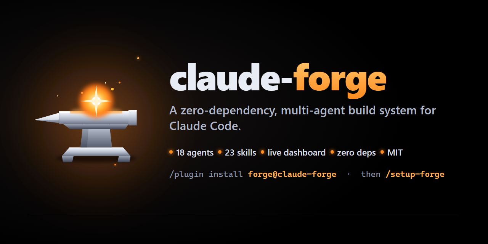

<div align="center">



# claude-forge

Turn Claude Code into a coordinated **team of agents** that builds, automates, reviews and ships — with a live per-project dashboard. **19 agents, 72 skills, one command: `/forge`.** Everything is on by default; **`/forge config`** shows and changes any setting.

[](https://claude.com/claude-code)
[](LICENSE)
[](#what-you-get)
[](#requirements)
[](https://github.com/ForgeyClap/claude-forge/stargazers)

<sub>▶ `/forge build me a landing page` fans out a right-sized team while the localhost dashboard updates live</sub>

<br>

**[How it works](docs/HOW-IT-WORKS.md)**  ·  **[Quickstart](#-quickstart-60-second-setup)**  ·  **[Settings](docs/SETTINGS.md)**  ·  **[New to Claude Code?](docs/CLAUDE-CODE-BASICS.md)**  ·  **[How to ask](docs/HOW-TO-ASK.md)**  ·  **[Features](docs/FEATURES.md)**  ·  **[Agents](AGENTS.md)**  ·  **[Cost](docs/TOKEN-USAGE.md)**  ·  **[Commands](COMMANDS-QUICK-REF.md)**  ·  **[Troubleshooting](TROUBLESHOOTING.md)**

</div>

---

## 🤝 The beginner promise

Forge does it for you. It runs every command, script, install and build itself and never asks you to run a file or code. It does not ask 'shall I continue?' between phases. It stops for the hard gates — deploying, pushing, spending money, DNS, production, credentials, sending anything out, killing processes by name, destructive deletes, writing outside your project — and for a real usage-limit pause. Be precise about what "stops" means: three of those gates (destructive deletes, killing processes by name, git commands that throw work away) are enforced by a real hook that blocks the shell command before it runs; the others are rules the assistant follows and are checked by a text classifier, not by a technical stop — a model can still ignore a rule, so keep an eye on anything that deploys, pushes or spends. Everything is on by default; `/forge config` shows and changes any setting in one command, or just say it in chat.

**Nederlands:** Forge doet het voor je. Het draait elk commando, script, installatie en build zelf en vraagt je nooit om zelf een bestand of code te draaien. Het vraagt niet 'moet ik verder?' tussen fases. Het stopt alleen altijd voor de harde poorten — deployen, pushen, geld uitgeven, DNS, productie, credentials, iets versturen, processen op naam killen, destructief verwijderen, buiten je project schrijven — en een echte gebruikslimiet-pauze. Alles staat standaard aan; `/forge config` toont en wijzigt elke instelling met één commando, of zeg het gewoon in de chat.

> [!NOTE]
> **New to Claude Code itself?** Forge runs inside it, and installing Claude Code is the one step Forge cannot do for you. [docs/CLAUDE-CODE-BASICS.md](docs/CLAUDE-CODE-BASICS.md) explains, in English and Dutch, the paid plan, the install line for your shell, permission prompts, undo, usage limits and `/clear`.

---

## 🤖 Letting Claude install it for you

Paste this repository's link into Claude Code and say **"install this"**.

Your assistant should read **[AI-INSTALL.md](AI-INSTALL.md)** — it contains the exact commands, the
pre-flight checks, the verification it must actually run before claiming success, and what it must
never do (no secrets in config, no touching your existing `.claude/`, no unverified "it works").

---

## 🚀 Quickstart (60-second setup)

Three ways in — **plugin is fastest**. Every path ends at the same first run: **`/setup-forge`**.

### Path A — Claude Code plugin *(fastest, ~60s try)*

Inside Claude Code:

```
/plugin marketplace add ForgeyClap/claude-forge
/plugin install forge@claude-forge
/forge:setup-forge
```

This gives you the commands, 18 agents and 22 curated skills (the LITE plugin is fully featured but smaller; see the comparison table below). It runs read-only from the plugin cache — no dashboard, no key setup, no `/forge config` settings file, no safety hook and none of the vendored public skills. Those come with Path B.

### Path B — One-line installer *(full system)*

**macOS / Linux:**

```bash
curl -fsSL https://raw.githubusercontent.com/ForgeyClap/claude-forge/main/install.sh | bash
```

**Windows (PowerShell):**

```powershell
powershell -ExecutionPolicy Bypass -c "irm https://raw.githubusercontent.com/ForgeyClap/claude-forge/main/install.ps1 | iex"
```

**Run either one-liner from inside your project folder** (`cd my-project` first): the installer puts the project payload in the *current* folder and refuses to run in your home directory. Both prompt once for confirmation. Then, inside your project, run `/setup-forge`.

**Windows or macOS/Linux — pick one column and stay in it** (the same Forge lands either way; only the shell differs):

| | Windows (PowerShell) | macOS / Linux (bash) |
|---|---|---|
| Installer | `install.ps1` — `powershell -ExecutionPolicy Bypass -File .\install.ps1 -ProjectDir "C:\path\to\project" -Yes` | `install.sh` — `bash install.sh --project "/path/to/project" --yes` |
| Unattended | `-Yes` or `$env:FORGE_YES = '1'` | `--yes` or `FORGE_YES=1` |
| Preview / partial | `-DryRun` · `-GlobalOnly` · `-ProjectOnly` | `--dry-run` · `--global-only` · `--project-only` |
| Global core lands in | `%USERPROFILE%\.claude` | `~/.claude` |
| Verify | `node .claude\forge-bin\forge-doctor.cjs` → `⇒ ALL GREEN` | `node .claude/forge-bin/forge-doctor.cjs` → `⇒ ALL GREEN` |
| Terminal wrappers | `.claude\forge-bin\*.cmd` (prefer `.cmd`; `.ps1` may be blocked by execution policy) | `bash .claude/forge-bin/*.sh` |

*(The `-ExecutionPolicy Bypass` prefix is required for `irm | iex` and for blocked `.ps1` files; it applies to that one command only. Never run `install.sh` in PowerShell/cmd.exe or `install.ps1` in bash. The full step-by-step table an AI assistant follows is in [AI-INSTALL.md §2a](AI-INSTALL.md).)*

### Path C — Manual copy *(no scripts — PARTIAL install)*

<details>
<summary>Clone and copy the payload yourself (you lose four things the installer does — read the note)</summary>

> **What a manual copy does NOT give you:** the canonical template in `~/.claude/forge/template` (so `forge-sync status` reports "update check: NOT PERFORMED"), the `.claude/FORGE_VERSION.json` marker (so `installed=none`), the seeded project `CLAUDE.md`, and the Forge lines in `.gitignore`. Also note that `cp -r`/`Copy-Item -Recurse` into an *existing* `.claude` nests a `.claude/.claude`. Prefer Path B; use this only when scripts are not allowed.

```bash
git clone https://github.com/ForgeyClap/claude-forge
# per-project system → your project
cp -r claude-forge/.claude your-project/.claude
# global core → your user config (makes /forge work everywhere)
cp -r claude-forge/global-install/.claude/* ~/.claude/
```

**Windows:**

```powershell
Copy-Item -Recurse claude-forge\.claude your-project\.claude
Copy-Item -Recurse claude-forge\global-install\.claude\* $HOME\.claude\
```

> Manual copy overwrites. Back up your own `~/.claude/skills` and `~/.claude/agents` first — the installer does timestamped, file-by-file backups automatically, so prefer Path B.

</details>

Then run `/setup-forge` once. With Path A or B you are ready; with Path C, expect the doctor to point at the four gaps above.

**Bam — you are ready.** ✨

---

> [!TIP]
> **New to Forge?** You do **not** need to learn 72 skills or 19 agents. Run `/setup-forge` once, then just say `/forge <what you want>` — Forge picks the smallest right-sized team and does it. Not sure how to phrase it? See [docs/HOW-TO-ASK.md](docs/HOW-TO-ASK.md).

---

## 🔌 Plugin vs Installer

The plugin is **LITE**; the installer is **FULL**. This split is architectural, not a limitation we chose: a plugin lives in a read-only cache, so *installing* it writes nothing to your project or `~/.claude`. Its commands and agents still edit your project when you ask them to build something — that is what they are for; the difference is that the plugin brings no settings file, no safety hook and no dashboard.

| | 🔌 **Plugin (LITE)** | 🛠️ **Installer (FULL)** |
|---|---|---|
| **What you get** | Commands + 18 agents + 22 curated skills (incl. the prompt coach) | Full system: 19 agents, 72 skills (incl. 21 vendored public skills), 102 tools |
| **Files written by the install** | None (read-only plugin cache); its agents edit your project only when you ask them to build | `./.claude` + `~/.claude` core |
| **Live dashboard** | No | ✅ Yes, localhost:4100 |
| **Key & `.env` setup** | No | ✅ Yes, via `/setup-forge` |
| **Settings (`/forge config`)** | No | ✅ Yes, 36 settings, everything on by default |
| **Safety stop + `.env` deny rules** | No | ✅ Yes, in the shipped `.claude/settings.json` |
| **Commands** | Namespaced `/forge:forge` | Bare `/forge` |
| **Best for** | Quick trial, prototyping | Real projects, long-term |

---

## 🆚 Claude Code alone vs Claude Code + Forge

Honest and non-adversarial — only rows that actually ship.

| Capability | Claude Code alone | + Forge |
|---|:---:|:---:|
| Multiple agents on one task | Manual | ✅ Automatic, right-sized |
| Coordination & task routing | — | ✅ `forge-router` |
| Automated review pass | On request | ✅ Optional, built in |
| Live progress dashboard | — | ✅ Per-project localhost |
| Project memory & task history | — | ✅ `FORGE_*` files |
| Domain playbooks (web / n8n / RAG / scraping) | — | ✅ Included |
| First-run onboarding wizard | — | ✅ `/setup-forge` |
| Runtime dependencies | — | ✅ **Zero** |

---

## 📦 What you get

| | |
|---|---|
| 🤖 **19 agents in the full install** | 12 permanent Bosses + 7 specialists — see [AGENTS.md](AGENTS.md). The LITE plugin carries 18 agents. |
| 🧠 **72 skills (full), 22 (LITE)** | 51 Forge skills (routing, domain playbooks, the prompt coach, reporting, verification, ship-readiness) plus 21 well-known public skills that ship with Forge — see [docs/FEATURES.md](docs/FEATURES.md) and [the section below](#-public-skills-that-ship-with-forge). The GSAP and humanizer skills the maintainer uses in development are still deliberately **not** redistributed — see [.claude/skills/VENDORED-SKILLS.md](.claude/skills/VENDORED-SKILLS.md). |
| ⚙️ **`/forge config`** | every setting in one list, with its value, where it comes from and what it does; change any of them with one command or one sentence — see [docs/SETTINGS.md](docs/SETTINGS.md) |
| 🛡️ **A real safety stop** | a hook blocks mass deletes, killing programs by name and git commands that throw away work until you say yes; Claude's file-reading tool cannot open your `.env` secret files (a shell command still can — see [docs/CLAUDE-CODE-BASICS.md](docs/CLAUDE-CODE-BASICS.md)) |
| 📊 **Command Center dashboard** | one localhost app on `127.0.0.1:4100` that auto-discovers your projects and shows *real* activity per project |
| ⌨️ **`/forge` + `/setup-forge`** | one command to work, one to onboard — see [COMMANDS-QUICK-REF.md](COMMANDS-QUICK-REF.md) |
| ✅ **Honest agent ledger** | every run records which agents *actually* ran, with evidence |
| 🪶 **Zero dependencies** | Forge's own tools are plain Node `.cjs` — nothing to `npm install`. The optional dashboard's one-time build is the only npm step, and it is run for you (see [The dashboard](#-the-dashboard)). |

> [!NOTE]
> Forge ships **19 agents** in the full install (12 permanent Bosses + 7 specialists); the LITE plugin carries **18 agents** (all Bosses + 6 specialists, missing verify-boss). Both are driven as real Claude Code Agent-tool subagents. Forge can also **route to your wider agent ecosystem** (any ECC / Claude Code agent types you have installed) when a task calls for it — but only Forge's own agents are claimed as "shipped".

---

## 🆕 What's new — v2.7.0 (see [CHANGELOG.md](CHANGELOG.md) for every release, including 2.4.0)

<details>
<summary><b>Beginner release — everything on, one settings command, a real safety stop</b> — click to expand</summary>

This release is built for people who are new to AI coding. It is based on three read-only research tracks (35, 75 and 89 sources) into how beginners steer an AI, which mistakes they make and which public skills help them.

- **`/forge config`** — one command lists all 36 settings with their value, where the value comes from and what it does, and changes any of them. Or just say it in chat ("pause at 95 percent"). Forge notices a change at the start of the next run and tells you. See [docs/SETTINGS.md](docs/SETTINGS.md).
- **Everything on by default** — including the usage guard, which now pauses at **98 %** (it was opt-in in 2.4.0; see below why that changed). Three things stay off or report-only on purpose: `paperclip`, `cleanup` and `ecc-full-test`.
- **The beginner promise** — Forge runs every command itself, never asks you to run code, and never asks "shall I continue?" between phases (see [the promise above](#-the-beginner-promise)).
- **A real safety stop** — a hook now *blocks* mass deletes, killing programs by name and git commands that throw away uncommitted work, including `git checkout .` and `git restore <path>`, which were not caught before. Claude can no longer read your `.env` secret files.
- **21 public skills ship with Forge** — 13 from obra/superpowers, frontend-design and claude-md-improver from Anthropic, and 6 from mattpocock/skills, each pinned and with its licence. Plus two commands: `/commit` and `/revise-claude-md`.
- **Prompt coach** — Forge checks your request for the classic gaps, fills small ones itself and asks at most one easy multiple-choice question. Guide: [docs/HOW-TO-ASK.md](docs/HOW-TO-ASK.md).
- **Doctor beginner checks** — the health check now warns about a CLAUDE.md over 200 lines, `claude`/`git`/`node` missing from PATH, bypass mode as a default and a WSL project under `/mnt/c`, and shows a read-only summary of `claude doctor`.
- **Command Center** — a read-only "Forge settings" section in Settings, served by a new `GET /api/config`.
- **New page for beginners:** [docs/CLAUDE-CODE-BASICS.md](docs/CLAUDE-CODE-BASICS.md) (English and Dutch).

</details>

---

## ⚙️ Settings in one command

Everything is **on** by default. **`/forge config list`** shows every setting; **`/forge config set <setting> <value>`** changes one; **`/forge config explain <setting>`** tells you exactly what it does. You can also just say it: *"zet de usage guard op 97%"*, *"vraag me niet meer bij elke fase"*, *"codex review off"* — Forge runs the command itself and repeats the result in one line.

This is the real output of `/forge config list` on a fresh 2.7.0 install (project folder `proj`, empty home), trimmed to the first eight settings of the core group. Each row: on/off, the setting, its value, where the value comes from, and what it does:

```text
Forge settings - project "proj" (everything is ON by default; change it with one command)

Status  Setting                      Value                    From             What it does
------  ---------------------------  -----------------------  ---------------  ----------------------------------------

== On by default - Forge uses this on every run ==
ON      usage-guard                  on                       default          Pauses Forge automatically when your
                                                                               Claude usage nears the limit. It measures
                                                                               on an interval (2 minutes by default), so
                                                                               this is a pause before the limit, not a
                                                                               guaranteed instant block. [1]
ON      usage-guard.pause-at         98 %                     default          Forge pauses at this percentage of your
                                                                               usage limit.
ON      autonomy                     continue-within-mission  product-default  Keeps working across phases without
                                                                               asking 'continue?' each time. STOP always
                                                                               works; deploy/push/spend/DNS/production
                                                                               always ask first.
ON      start-gate                   off                      default          Does not wait for a START before building
                                                                               - the plan is posted and work continues
                                                                               immediately (say STOP to pause).
ON      gate-hook                    on                       default          A real stop (not advice) on dangerous
                                                                               commands: recursive deletes, killing
                                                                               processes by name, git commands that
                                                                               throw away uncommitted work, and commands
                                                                               that hide what they run (eval, a pipe
                                                                               into a shell). Forge asks first.
ON      git-checkpoint               on                       default          Creates a local git safety point (commit
                                                                               or branch, never pushed) before a bigger
                                                                               build so everything can be undone.
ON      intake                       silent                   default          Answers the intake questions itself from
                                                                               your request and the project; asks at
                                                                               most one multiple-choice question (2-3
                                                                               options), only when two readings would
                                                                               lead to materially different builds or
                                                                               when something must be sent, paid or
                                                                               deployed.
ON      prompt-doctor                on                       default          Checks your request for the classic traps
                                                                               (vague goal, no definition of done, no
                                                                               context) and fills the gaps itself or
                                                                               asks the one targeted question.
... (8 of the 36 settings; the full list, with the where-from column and every group: /forge config list --all)
```

The most important ones for a beginner: **`usage-guard`** (on, pauses at **98 %** before your limit), **`gate-hook`** (on, the safety stop below), **`git-checkpoint`** (on, a local safety point before a bigger build), **`intake`** (`silent`: at most one question) and **`explain-mode`** (on: one plain sentence per phase). The full list of all 36 settings (core, when-needed and advanced) with every default, the 7 locked rules that can never be switched off, and where your choices are saved: **[docs/SETTINGS.md](docs/SETTINGS.md)**.

---

## 🛡️ A real safety stop

Written rules are advice; a model can still ignore them. So Forge adds a small check that runs **before every shell command** Claude wants to run. It blocks four dangerous kinds of command until you say yes: deleting whole folders at once (`rm -r`, with or without `-f`, `Remove-Item -Recurse`), stopping programs by name (`taskkill /IM`, `pkill`, also via `pgrep` tricks), git commands that throw away work you have not committed (`git reset --hard`, `git checkout .`, `git restore <path>`, `git switch -f`), and commands whose real content is hidden from the check (`eval`, `Invoke-Expression`, `bash -c "$SCRIPT"`, anything piped straight into a shell such as `curl … | sh`). Cleanups inside temporary folders (`_scratch`, `node_modules`, `dist`, the system temp folder outside your project) still pass, but only when the check can prove the path really is such a folder, and quoted text (a heredoc, an `echo`, a `grep` pattern) is never mistaken for a command. If the check cannot judge a command (unreadable input, a damaged config) it says so out loud instead of silently letting it through. The same settings file stops Claude from reading your `.env` secret files (also the `.env.development`, `.env.staging`, `.env.test` and setup variants, at any depth), `secrets/` folders, private keys and your own credential files (28 rules); `.env.example` stays readable. The stop is built so the assistant cannot switch it off on its own: an agent that types `set gate-hook off` is blocked, only `/forge config set gate-hook off` typed by you switches it off, and the one-off form (`--once "<your words>"`) must quote your approval, covers exactly one command, is used up the moment that command runs and expires after at most 10 minutes. What the check cannot do is verify who typed that quote, so when Claude reports "the owner approved this command", read that line before it runs. While the stop is off you still see a notice for every command it would have stopped. (If your project already had its own `.claude/settings.json`, the installer merges Forge's hooks and deny rules into it — your own entries stay in place, formatting is preserved, a backup is written first, and running it again changes nothing; a file it cannot preserve losslessly is left alone and reported. Upgrades through `forge-sync install` do the same, so an older Forge project gets the safety stop too.)

---

## 🧩 Public skills that ship with Forge

So a beginner never has to hunt for skills, Forge now ships **21 well-known public skills** and **2 commands**, and its Bosses use them automatically:

- **13 from obra/superpowers** (MIT) — brainstorming, writing and executing plans, test-driven development, systematic debugging, code review, verification before completion, git worktrees and more.
- **frontend-design** and **claude-md-improver** from Anthropic (Apache-2.0).
- **6 from mattpocock/skills** (MIT) — grill-me, grilling, teach, wait-what, resolving-merge-conflicts and setup-pre-commit (that last one only runs when you ask for it).
- **Commands:** `/commit` (one local commit of your changes; it never pushes) and `/revise-claude-md` (updates your CLAUDE.md with what the session learned).

Each vendored skill is pinned to an exact upstream commit, keeps its upstream `LICENSE` file in its folder and carries a provenance header at the top of its `SKILL.md`. Every change Forge made is listed in [.claude/skills/VENDORED-SKILLS.md](.claude/skills/VENDORED-SKILLS.md). The GSAP skills (no open licence) and humanizer are still **not** shipped. The LITE plugin does not include these vendored skills.

---

## 💬 Not sure how to ask?

You cannot ask wrong. Forge's **prompt coach** checks your request for the classic gaps — a vague goal, no "done when", no example. Small gaps it fills itself with safe choices and writes them in the plan, so you can change them later. If one gap really changes what gets built, Forge asks you **one** question with 2–3 plain choices plus "something else", and then says in one sentence what it will build ("So I'll build: … Is that right?"). A one-page guide with a fill-in sentence and examples, in Dutch and English: **[docs/HOW-TO-ASK.md](docs/HOW-TO-ASK.md)**.

---

## ⚙️ How it works

Normally Claude Code is **one assistant**. Forge turns it into a **coordinated team**: you give one instruction, Forge picks the right-sized team, does the work in parallel, checks its own work, and reports back — honestly.

```
You:  /forge build me a landing page for my bakery
          │
          ▼
  1. Classify   →  what kind of job is this?               (forge-router)
  2. Size team  →  the smallest team that fits (1–12+)      (fan-out L1–L4)
  3. Plan       →  split into exact work packages           (Boss → Head Chef)
  4. Build      →  specialists do the work, in parallel     (Build / UI / SEO / … Bosses)
  5. Check      →  real tests + review against YOUR goal    (Test Boss → Review Boss)
  6. Fix-loop   →  fail → report → fix → re-test (bounded)
          │
          ▼
You get:  the finished result + an honest report of what actually ran + a live dashboard.
```

**Nothing is called "done" until it's proven** — Forge never fabricates a passing test, a fake "done", or an agent that didn't run. Every run is **project-isolated** (only your target folder) and **zero-dependency**.

📖 **Want the full picture?** [**How Forge works — the complete walkthrough →**](docs/HOW-IT-WORKS.md) — a real bakery-landing-page example, the QA loop step by step, and exactly what you see.

---

## 💸 What does it cost?

Honest answer: **a team of agents uses more tokens than a single chat** — that's the price of a coordinated, self-checking team. Forge's job is to spend them **well**:

- **Tiered models** — Opus only for the hard/critical work, **Sonnet** for most of it, **Haiku** for trivial steps, and pure mechanical edits use **no model at all**.
- **Right-sized teams** — a one-line fix doesn't summon a swarm; over-spawning is treated as waste, not a feature.
- **Real cost visibility** — a live dashboard cost meter, plus a **usage guard** that reads the same official numbers as `/usage` and **pauses Forge at 98 %** of your 5-hour or weekly limit — *before* the limit. It measures every 2 minutes (best effort: a task can still cross the limit between two samples, so this is a pause before the limit, not a guaranteed instant block). Claude Code itself (version 2.1.234 and later) already waits and continues after a limit reset; the guard's job is the pause before it.

You pay through your existing Claude Code plan (no separate billing), and Forge **never invents a "savings" number**.

> [!NOTE]
> **The usage guard is on by default since 2.7.0.** In 2.4.0 it was opt-in. The maintainer reversed that so beginners are protected without having to know it exists. The guard reads your Claude login token locally from `~/.claude/.credentials.json` and sends it only to `api.anthropic.com`; it tells you exactly that, once, when it really starts. One command switches it off: `/forge config set usage-guard off`. Change the threshold with `/forge config set usage-guard.pause-at 90`.

💸 **[Full token & cost guide →](docs/TOKEN-USAGE.md)**

---

## 🧭 The onboarding wizard

`/setup-forge` asks four friendly questions (name, goal, project type, language), auto-detecting what it can from your repo. Then comes the **beginner-safe key flow**:

1. Forge writes a temporary, **already-gitignored** fill-in file with labelled placeholders and where-to-get-each-key links.
2. You paste your keys, save, and say **"done"**.
3. Forge moves the values into a gitignored `.env`, writes a values-free `.env.example`, and **deletes the temp file** — nothing is ever committed, and secret values are never echoed back.

Keys are **optional** — Forge runs fine without any.

---

## 📊 The dashboard

The **Forge Command Center** is the dashboard — one local app on `http://127.0.0.1:4100` that auto-discovers your Forge projects and shows strictly per-project data. It is **optional**: Forge works fully without it.

**You never type the setup yourself.** The dashboard ships as source in this repository's `command-center/` folder (the installers do not copy it into your project). Its web page needs a one-time build — the only npm step anywhere in Forge. When an AI assistant installs Forge from a clone, it does that build and starts the dashboard for you ([AI-INSTALL.md §6](AI-INSTALL.md)). After that, `/forge dashboard` in any project checks it and gives you the address. If no dashboard is running, Forge says so in one line and keeps working.

<details>
<summary>What gets run for you (for the curious)</summary>

```bash
cd command-center/dashboard && npm install && npm run build   # build the web page once
cd ../.. && node command-center/gateway/supervisor.mjs        # start it (restarts the gateway if it dies)
# then http://127.0.0.1:4100 — GET /api/health must answer before anyone calls it "running"
```

</details>

The **Settings** view has a read-only **Forge settings** section that shows the active project's settings, read from `GET /api/config`; you change them in chat or with `/forge config`.

The gateway is zero-dependency Node and is the **only** layer allowed to spawn the real `claude` CLI. Run events stay per-project: every run writes `.claude/forge-runs/<run_id>/events.jsonl` via `.claude/forge-dashboard/log-event.cjs`, and the Command Center reads those **read-only**. It shows **real activity only** — never fabricated, never shared across projects.

> **The old per-project Control Center is retired.** `.claude/forge-dashboard/server.cjs` still exists and still works on an explicit `legacy dashboard` request, but nothing starts it automatically any more. Its `log-event.cjs` is *not* retired — that remains the run-event writer described above.

---

## 🍳 Examples & recipes

```
/forge build me a landing page for my bakery
/forge create an n8n automation that emails new leads to my inbox
/forge refactor the auth module and keep the tests green
/forge audit this codebase for security and dead code
/forge scrape public product listings into a CSV
```

---

## 🔐 Configuration & safe key setup

- **`.env.example`** ships with key *names* and comments only — never values. Prefer `/setup-forge` over hand-editing.
- **Gitignore invariant:** `.env`, `.env.*` (except `.env.example`) and the temp `.env.forge-setup` are ignored. If a `.env` is already tracked, Forge stops and warns you to `git rm --cached .env` and rotate.
- **Storage tier:** the honest default is a gitignored `.env` with `0600` perms. An OS keychain (macOS Keychain / Windows Credential Manager / libsecret) is an **optional advanced** upgrade — never required, never faked.
- **Model tiers** are configurable in `.claude/config/` — route routine work to cheaper models and escalate high-risk work.
- **Every Forge switch** (usage guard, safety stop, intake, dashboard, Codex review, …) lives in one place: `/forge config` — see [docs/SETTINGS.md](docs/SETTINGS.md). Settings files never hold secrets.
- **Secret files are off-limits to Claude:** the shipped `.claude/settings.json` denies reading `.env`, `.env.local`, the common `.env.*` variants and `secrets/**`.

---

## ❓ FAQ

**Do I need to install dependencies?** No. Forge's tools are plain Node `.cjs` — nothing to `npm install`. The only npm step is the optional dashboard's one-time build, and it is run for you.

**Do I have to type commands or run scripts?** No. Forge runs every command, install and build itself. The one thing it cannot do is install Claude Code, because Forge runs inside it — see [docs/CLAUDE-CODE-BASICS.md](docs/CLAUDE-CODE-BASICS.md).

**How do I change a setting?** Say it in chat ("turn off the codex review") or use `/forge config set <setting> <value>`. `/forge config list` shows everything — see [docs/SETTINGS.md](docs/SETTINGS.md).

**Will it touch my other projects?** No. Forge is **project-isolated** and works only in the target folder.

**Is it safe with my API keys?** Yes. The temp `.env` is gitignored the moment it is created, keys are moved into place and the temp file is deleted, and values are never committed or printed back.

**Why is the command `/forge:forge` sometimes and `/forge` other times?** Plugin commands are always **namespaced** (`/forge:forge`, `/forge:setup-forge`). The installer copies the core into `~/.claude`, giving you the **bare** `/forge` and `/setup-forge`. Both do the same thing.

**Does it work on Windows?** Yes — Windows-first, and cross-platform (macOS/Linux) throughout.

---

## 🚫 What it does *not* do

- It does **not** run without Claude Code — Forge is a configuration layer on top of it.
- It does **not** deploy, push, or spend money on your behalf without you asking.
- It does **not** fabricate results — no fake "done", no invented tests, no imaginary agents.
- It does **not** ship a hosted/global dashboard — every dashboard is local and per-project.

**Roadmap:** deeper reviewer integrations and more domain playbooks. See the architecture decision record: [`docs/adr/0001-plugin-vs-installer-split.md`](docs/adr/0001-plugin-vs-installer-split.md).

---

## 🌍 Internationalization

**Forge speaks your language.** The onboarding wizard, replies and reports follow the language you pick in `/setup-forge`. **English is the default**; translations are welcome — see [CONTRIBUTING.md](CONTRIBUTING.md).

---

## ⭐ Star history

If Forge saves you time, a star helps others find it.

[](https://github.com/ForgeyClap/claude-forge/stargazers)

[](https://star-history.com/#ForgeyClap/claude-forge&Date)

<sub>No fabricated stars or testimonials — the counts above are live from GitHub.</sub>

---

## 📚 Documentation

| Doc | What's in it |
|---|---|
| [**docs/HOW-IT-WORKS.md**](docs/HOW-IT-WORKS.md) | **Start here.** Plain-language walkthrough of a task from your sentence to a checked result, with a real example and the QA loop. |
| [**docs/CLAUDE-CODE-BASICS.md**](docs/CLAUDE-CODE-BASICS.md) | **New to Claude Code?** Paid plan, the install line for your shell, permission prompts, undo, usage limits, `/clear`, CLAUDE.md and three myths — English and Dutch. |
| [**docs/HOW-TO-ASK.md**](docs/HOW-TO-ASK.md) | How to ask Forge for something: a fill-in sentence, five examples and three common mistakes — Dutch and English. |
| [**docs/SETTINGS.md**](docs/SETTINGS.md) | Every setting with its default and what it does, how to change it, where it is saved, and the 7 locked rules. |
| [**docs/TOKEN-USAGE.md**](docs/TOKEN-USAGE.md) | Honest token & cost guide — model tiering, right-sized teams, the usage guard, and how to keep it cheap. |
| [**docs/FEATURES.md**](docs/FEATURES.md) | The complete catalogue — every skill, playbook, tool and guarantee, explained in depth. |
| [**AGENTS.md**](AGENTS.md) | All 19 agents (12 permanent Bosses + 7 specialists) — role, when-used, tools, and the QA fix-loop. |
| [**COMMANDS-QUICK-REF.md**](COMMANDS-QUICK-REF.md) | Every command and terminal tool with examples (namespaced plugin vs bare installer forms). |
| [**TROUBLESHOOTING.md**](TROUBLESHOOTING.md) | Symptom → cause → fix for common newcomer issues — run `/setup-forge doctor` first. |
| [**CONTRIBUTING.md**](CONTRIBUTING.md) · [**SECURITY.md**](SECURITY.md) · [**CHANGELOG.md**](CHANGELOG.md) | How to contribute · report a vulnerability · release history. |
| [**docs/adr/0001…**](docs/adr/0001-plugin-vs-installer-split.md) | Architecture decision: why the plugin is lite and the installer is full. |

---

## Requirements

- **[Claude Code](https://claude.com/claude-code)** — Forge is a configuration layer for it. Claude Code needs either a **paid Claude plan** (Pro, Max, Team or Enterprise) or a **Claude Console account with API billing** — the free consumer plan does not include it; see [docs/CLAUDE-CODE-BASICS.md](docs/CLAUDE-CODE-BASICS.md).
- **Node.js 18+** — for Forge's `.cjs` tools (no packages to install). Claude Code itself does not need Node; Forge's doctor tells you when it is missing. **Building the dashboard yourself** needs Node **20.19+ or 22.12+** (its build tool, Vite 7, refuses older versions); the installer ships the tools without that step.
- **Git** — recommended (leak-scan and safe key setup use it), not strictly required.

---

## 🤝 Contributing

Contributions welcome — new skills, agents, playbooks and translations. See [CONTRIBUTING.md](CONTRIBUTING.md) and our [CODE_OF_CONDUCT.md](CODE_OF_CONDUCT.md).

**New to the internals?** Read the project-memory files in this order:
`FORGE_PROJECT_PROFILE.md` → `FORGE_MEMORY.md` → `FORGE_TASK_HISTORY.md` → `FORGE_AGENT_LEDGER.md`.

---

## 📄 License

[MIT](LICENSE) © ForgeyClap.

<div align="center">

**If Forge is useful, [give it a ⭐](https://github.com/ForgeyClap/claude-forge) — it genuinely helps.**

</div>
