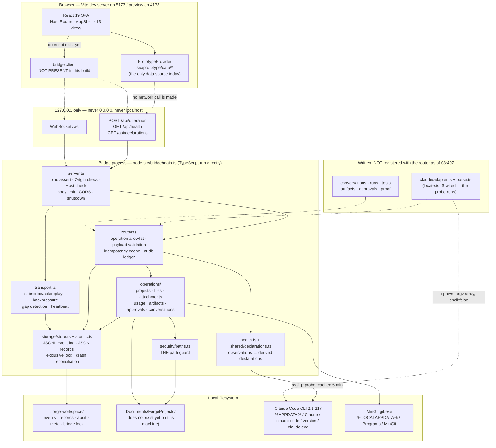
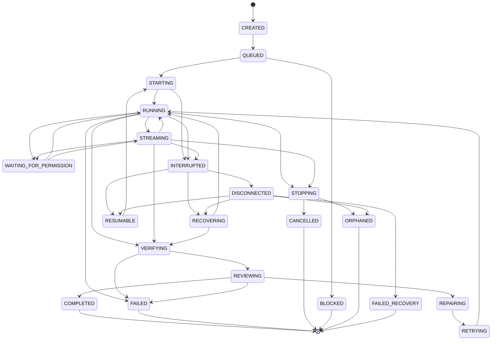

# Forge Workspace — architecture as it actually is

Written 2026-07-24 against the working tree at `c:\Users\YOU\Desktop\Forge dashboard`.

This document describes what exists **now**, not what is planned. Where a claim comes from
running something, the command and its real output are given. Where I could not establish a
fact, the document says so instead of filling the gap.

> **The bridge was being rewired while this was written.** I probed it twice, 12 minutes
> apart, and the number of registered operations went from **7/39 to 22/39**. Both readings
> are recorded in §7, along with the one-line command that gives you the current truth. Treat
> every count in this document as a timestamped observation, not a constant.

Two companion documents cover the futures that are deliberately **not** built:
[`mac-mini-migration.md`](./mac-mini-migration.md) and [`lan-mode-design.md`](./lan-mode-design.md).

---

## 1. How the facts below were established

| Fact | Command | Result |
| --- | --- | --- |
| Node version | `node --version` | `v24.18.0` |
| Resolved bridge config | `node src/bridge/main.ts --print-config` | bind `127.0.0.1`, port `4517`, `lanMode:false`, `remoteAccess:false` |
| Startup output, 03:28Z | `node src/bridge/main.ts --port 4599`, `FORGE_WORKSPACE_DIR` at a scratch dir | 7/39 operations — §7 |
| Startup output, 03:40Z | same, port 4601, after other work packages landed | 22/39 operations — §7 |
| Health snapshot, both runs | `node src/bridge/main.ts --health --port <n>` | quoted in §7 |
| Frontend has no bridge client | grep for `WebSocket|/api/operation|fetch\(|ws://|EventSource` across `src/` excluding `src/bridge/**` | only two hits, both the string `EventSource` as a *type name* in `protocol.ts` |
| Git install | filesystem check of `%LOCALAPPDATA%\Programs\MinGit` | present |
| Node install | filesystem check | `%LOCALAPPDATA%\Programs\nodejs\node.exe` — **not on the PATH of a fresh shell** |

Both bridge runs used a throwaway workspace directory rather than the repository's own
`.forge-workspace/`, because the store takes an exclusive lock and other work was in flight.
Everything quoted below is a real run's real output.

I did **not** verify: the Claude Code adapter end to end, the git wrapper, the attachment
pipeline, the WebSocket under a real client, the Playwright suite, or the bundle sizes. The
last three are claims from the task brief, not measurements I made.

---

## 2. The shape of the system



Solid arrows were observed working. Dashed arrows are intended connections that **were not
made as of the 03:40Z reading** — see §7 for the exact list and the evidence.

---

## 3. Processes and ports

There are two long-lived processes and they never share one.

| Process | Started by | Listens on | Notes |
| --- | --- | --- | --- |
| Vite dev server | `npm run dev` | `5173` (preview: `4173`) | Serves the SPA. Does not proxy to the bridge. |
| Bridge | `npm run bridge` (`node src/bridge/main.ts`) | `127.0.0.1:4517` | Default port chosen away from 5173/4173 so the two never collide. |

The bind address is a compile-time constant. `src/bridge/config.ts` declares
`BIND_ADDRESS = '127.0.0.1'`, and `loadConfig()` **refuses to produce a config at all** if
any of eleven environment variables that look like an attempt to move it are present
(`FORGE_BRIDGE_BIND`, `FORGE_BRIDGE_HOST`, `FORGE_BRIDGE_LAN`, `FORGE_BRIDGE_TUNNEL`, and
so on). Refusing is deliberate: silently ignoring such a variable would leave the operator
believing the bridge was reachable when it was not, or vice versa.

`127.0.0.1` and not `localhost`: on Windows `localhost` resolves to `::1` first, which
would leave the IPv4 loopback unserved and time out every 127.0.0.1 client.

Operational settings that *are* tunable, all range-checked and rejected with a specific
message rather than silently defaulted:
`FORGE_BRIDGE_PORT`, `FORGE_BRIDGE_HEARTBEAT_MS`, `FORGE_BRIDGE_MAX_REQUEST_BYTES`,
`FORGE_BRIDGE_EXTRA_ORIGINS` (loopback origins only, max 16), `FORGE_WORKSPACE_DIR`.

---

## 4. The event envelope

Defined once in `src/shared/protocol.ts` and imported by both sides, so the browser and the
bridge cannot drift.

```ts
interface ForgeEvent<P = unknown> {
  readonly eventId: string;          // unique; used for dedupe on append
  readonly schemaVersion: number;    // PROTOCOL_SCHEMA_VERSION === 1
  readonly sequence: number;         // monotonic PER STREAM, assigned by the store
  readonly timestamp: string;        // ISO-8601, from the emitter
  readonly projectId: string;        // '__bridge__' for bridge-scoped events
  readonly runId: string | null;
  readonly sessionId: string | null;       // Claude Code's own session id
  readonly conversationId: string | null;
  readonly taskId: string | null;
  readonly agentId: string | null;
  readonly source: 'forge' | 'claude-code' | 'bridge' | 'test' | 'user';
  readonly type: string;             // one of EVENT_TYPES (50 names)
  readonly status?: OperationalStatus;
  readonly payload: P;
  readonly evidenceRefs: readonly EvidenceRef[];
  readonly ingestedAt?: number;      // bridge ingestion time, ms — used for latency
}

interface EvidenceRef {
  readonly kind: 'file' | 'artifact' | 'stdout' | 'stderr' | 'exit-code' | 'event' | 'verdict';
  readonly ref: string;              // project-relative where possible
  readonly hash?: string;
  readonly note?: string;
}
```

Two properties of this envelope carry most of the design weight.

**`sequence` is per-stream and assigned by the durable store, by nothing else.** A stream key
is `<projectId>~<runId>`, with `_` standing in when there is no run — the bridge's own stream
is therefore the file `.forge-workspace/events/__bridge__~_.jsonl`, which is exactly what is
on disk. Because the sequence is dense per stream, `1, 2, 4` is *detectably* a hole rather
than three events that happened to arrive. `store.ts` assigns it synchronously with no
`await` between reading the head and appending the line, which is why the storage primitives
in `atomic.ts` are synchronous by design.

**`evidenceRefs` is a pointer, never the claim.** A path plus a hash can be re-checked later;
a sentence cannot. This is what the evidence gates in §6 consume.

### Transport frames

The WebSocket carries frames, not bare events (`src/bridge/transport.ts`):

- server → client: `hello`, `subscribed`, `event`, `events` (replay/catch-up), `response`,
  `heartbeat`, `notice`, `error`. Every frame carries `sentAt` so end-to-end latency is
  measurable from real timestamps rather than estimated.
- client → server: `subscribe`, `unsubscribe`, `ack`, `replay`, `request`, `ping`.

Delivery is proved by the **ack**, not by the send. A frame handed to a socket is not
evidence — the buffer may still hold it when the process dies. When a client's socket buffer
passes 1 MiB the transport *stops pushing to it* rather than queueing in the bridge heap, and
resumes below 256 KiB. `bridge.reconciled` is emitted only after the client acks at or beyond
the head that was missing; if it never acks, the stream stays degraded forever, which is the
truthful outcome.

---

## 5. Storage on disk

```
.forge-workspace/
  bridge.lock                    pid + token + heartbeat; advisory, with staleness takeover
  meta/workspace.json            layout version
  meta/migrations.json           applied migrations
  events/<projectId>~<runId>.jsonl   append-only, one event per line
  audit/ledger.jsonl             one line per dispatched operation
  records/{project,conversation,run,test,verification,artifact,attachment,approval,proof,checkpoint}/<id>.json
```

Resolution order for the workspace directory: explicit option → `FORGE_WORKSPACE_DIR` →
`<repoRoot>/.forge-workspace`. It must be absolute and must not be a filesystem root.

Project data lives somewhere else entirely: `<Documents>/ForgeProjects`. Documents is
*discovered*, never assumed — see §8.

`atomic.ts` guarantees, with their stated limits:

1. **Writes are all-or-nothing.** Temp file in the same directory → `fsync` → rename over the
   target. The directory itself often cannot be fsynced on Windows, so the result reports
   `directorySynced: false` rather than pretending the metadata was flushed.
2. **Reads never throw on bad data.** Corruption after a crash is an expected state, returned
   as a typed result.
3. **The lock is advisory and says so.** It stops two bridges interleaving appends in every
   realistic case. It is not a distributed mutex, and the residual race is documented on the
   function rather than hidden.

---

## 6. State machines and evidence gates

`src/shared/state-machines.ts` defines ten machines (`run`, `task`, `agent`, `test`,
`permission`, `attachment`, `claude-session`, `project`, `artifact`, `stream`) over the 42
states the contract declares. The file does zero I/O — no clock, no filesystem, no
randomness — so the whole thing is exhaustively testable, and it can be loaded by the browser
bundle and by Node alike.

Compile-time totality proofs (`Proof<Exclude<...>>`) fail `tsc` if a state is added to
`protocol.ts` without being given an owning machine. An unmodelled state cannot reach a screen.

### The run machine



*(Edges are elided for readability; the authoritative table is the `RUN_MACHINE` literal.
Terminal states are `COMPLETED`, `FAILED`, `CANCELLED`, `BLOCKED`, `ORPHANED`,
`FAILED_RECOVERY`, and nothing may leave them.)*

The shape encodes two invariants **structurally**, not by advisory check:

- `COMPLETED` has exactly one predecessor: `REVIEWING`.
- `REVIEWING` has exactly one predecessor: `VERIFYING`.

So there is no path to "done" that skips verification and review — not from `CREATED`, not
from `RUNNING`, not from `FAILED`, not from `DISCONNECTED`. `RUNNING -> COMPLETED` is refused
by construction, with a message that names what would have been lied about.

### Evidence gates

The transition table stops nonsense orderings. It cannot stop a caller writing `RUNNING` for
a process that never started. That is the second lock. Five gates exist —
`running`, `completed`, `failed`, `verifying`, `reviewing` — each in a throwing `assert*`
form for the bridge (a missing fact must stop the write) and a non-throwing `check*` form for
the UI (a missing fact must be *explained*).

`RUNNING` requires `runId`, `projectId`, `startedAt`, **and** either a pid whose liveness was
actually observed (`pidAlive === true`, from a real check — a pid alone is a number that was
once handed to us) or a Forge task id, **and** a heartbeat no older than 30 s judged against a
caller-supplied `observedAt`. A heartbeat dated in the future is also refused.

`COMPLETED` requires: an observed process exit (`processExitObserved === true`; a spawn is
not an exit), a recorded exit code, a reference to persisted output, a final event whose
`runId` matches *this* run, at least one proof ref including one of kind `exit-code`, a
verdict that is `VERIFIED_PASS` or `VERIFIED_PASS_WITH_LIMITATIONS`, and a verifier whose id
differs from the subject's. Self-approval is checked in one place rather than trusted to
every caller.

`FAILED` is held to the same standard. "It didn't work" needs proof too, otherwise a timeout
in our own code gets recorded as the run's failure and the real cause is never examined.

### Crash reconciliation

On startup the store walks every run record still claiming a live status and moves it to
`INTERRUPTED` or `ORPHANED` — **never** to `COMPLETED`.

- no pid recorded → `ORPHANED` ("the live status could never be verified")
- pid recorded, `isPidAlive` false → `INTERRUPTED`
- pid recorded and still alive, but no bridge owns it → `ORPHANED` ("process ids are reused,
  so this is not proof the run survived")
- liveness undeterminable → `ORPHANED`

Observed on the probe run: `reconciled 0 run record(s); 0 moved out of a live status;
0 stream(s) with sequence gaps; 0 degraded note(s)`.

---

## 7. What is wired, and what is not

This is the part most likely to be assumed rather than checked, and the part most likely to be
stale. **Get the current answer yourself:**

```powershell
$env:FORGE_WORKSPACE_DIR = "<some scratch dir>"
node src/bridge/main.ts --port 4599     # read the [bridge] block on stderr
node src/bridge/main.ts --health --port 4599 | ConvertFrom-Json
```

The bridge tells you the truth at startup without being asked. That property is the thing to
rely on; the numbers below are two dated samples of it.

### Reading 1 — 2026-07-24 03:28Z: 7 of 39

```
[bridge]   operations 7/39 registered
[bridge]   NOT YET IMPLEMENTED: listProjects, createProject, openProject, importProject,
archiveProject, getProjectHealth, listConversations, createConversation, openConversation,
archiveConversation, sendMessage, stopRun, resumeSession, listRuns, getRun, stageAttachment,
removeAttachment, listAttachments, getAttachmentPreview, listProjectFiles, readProjectFile,
getFileDiff, listArtifacts, inspectArtifact, listTests, runApprovedTest, listProof,
listApprovals, approveAction, denyAction, getUsageState, getUsageHistory
```

Registered: the router's own builtins only — `getHealth`, `getDeclarations`, `listEvents`,
`replayEvents`, `createCheckpoint`, `listCheckpoints`, `exportDiagnostics`.

### Reading 2 — 2026-07-24 03:40Z: 22 of 39

Twelve minutes later, with `src/bridge/operations/`, `src/bridge/health.ts` and
`src/shared/declarations.ts` newly present:

```
[bridge] listening on http://127.0.0.1:4601
[bridge]   LAN_MODE=false REMOTE_ACCESS=false
[bridge]   operations 22/39 registered
[bridge]   NOT YET IMPLEMENTED: listConversations, createConversation, openConversation,
archiveConversation, sendMessage, stopRun, resumeSession, listRuns, getRun, listArtifacts,
inspectArtifact, listTests, runApprovedTest, listProof, listApprovals, approveAction, denyAction
[bridge]   UNVERIFIED CONNECTED_TO_CLAUDE_CODE: No Claude Code probe result is available to this bridge, so nothing has been checked. This is not a claim that Claude Code is absent.
[bridge]   UNVERIFIED USES_REAL_PROJECTS: The registry holds 0 record(s); 0 path(s) could not be confirmed and 0 record(s) could not be read.
[bridge]   UNVERIFIED USES_REAL_AGENTS: No agent activation has ever been recorded. the event log holds no agent.activated event, so no agent has been observed to run
[bridge]   UNVERIFIED USES_REAL_COMMANDS: No process execution has ever been recorded. no run record carries a process id and no test record carries an exit code (0 run(s), 0 test execution(s) inspected)
[bridge]   UNVERIFIED USES_MOCK_DATA: No fixture source registered itself with this bridge, and the static scan proves no bridge module imports the prototype fixture tree.
[bridge]   UNVERIFIED USES_REAL_USAGE_TELEMETRY: No usage snapshot exists, so no telemetry has been reported by Claude Code.
[bridge]   UNVERIFIED SUPPORTS_FILE_ATTACHMENTS: No attachment pipeline is registered with this bridge.
```

Newly registered between the two readings: `listProjects`, `createProject`, `openProject`,
`importProject`, `archiveProject`, `getProjectHealth`, `stageAttachment`, `removeAttachment`,
`listAttachments`, `getAttachmentPreview`, `listProjectFiles`, `readProjectFile`,
`getFileDiff`, `getUsageState`, `getUsageHistory`.

Still unregistered at 03:40Z (17): everything conversation-, run-, test-, artifact- and
approval-shaped, and critically **`sendMessage` and `stopRun`** — so no message can yet be
sent to Claude Code through the bridge.

An unregistered operation returns a typed error that says exactly that:

> `The operation "<name>" is defined by the contract but no handler is registered in this
> build.` — detail: `UNIMPLEMENTED — the bridge did not attempt it and cannot report a
> result.`

That is deliberate. A stub returning empty success would make the UI render "no projects"
when the truth is "not wired up".

### The declarations stopped being assertions and became derivations

This is the most significant change between the two readings, and it is worth recording
carefully because it changes what §4's contract means.

At 03:28Z, `protocol.ts` exported a single flat `RUNTIME_DECLARATIONS` object in which
`CONNECTED_TO_FORGE`, `CONNECTED_TO_CLAUDE_CODE`, `USES_REAL_PROJECTS` and five others were
hardcoded `true` — claims the running process did not satisfy.

At 03:40Z that object is gone. In its place:

- **`INVARIANT_DECLARATIONS`** (7) — properties of the *build*, provable by a static scan:
  `USES_ANTHROPIC_API:false`, `REQUIRES_ANTHROPIC_API_KEY:false`,
  `USES_LOCAL_CLAUDE_CODE:true`, `PRODUCTION_MOCK_DATA_ALLOWED:false`, `LAN_MODE:false`,
  `REMOTE_ACCESS:false`, `BIND_ADDRESS:'127.0.0.1'`.
- **`INVARIANT_DECLARATION_PROOFS`** — a `Record<InvariantDeclarationName, string>` naming the
  test that proves each one, precisely enough to run. The `Record` type is load-bearing:
  adding an invariant without naming its proof stops the build, because "an unproven invariant
  is indistinguishable from a wish".
- **`DERIVED_DECLARATIONS`** (8) — claims about the *live system*, recomputed every time health
  is assembled, from observations the bridge actually made. `src/shared/declarations.ts` is
  pure (no I/O, no clock — everything is passed in), and `src/bridge/health.ts` does the
  looking.

The rule stated in `declarations.ts` and visible in the output above: **there is no
default-true and no branch that turns an absent observation into a positive claim.** Absent
evidence yields `value: false` plus a `missing` list naming exactly what was not there. So the
health body now carries, per derived declaration, an evidence block:

```json
"CONNECTED_TO_CLAUDE_CODE": {
  "value": false,
  "evidence": {
    "kind": "NONE",
    "summary": "No Claude Code probe result is available to this bridge, so nothing has been
                checked. This is not a claim that Claude Code is absent.",
    "missing": ["a completed Claude Code health probe"]
  }
}
```

A successful Claude Code probe is evidence for only 5 minutes
(`DEFAULT_CLAUDE_PROBE_FRESHNESS_MS`), after which the claim reverts to false with
`missing: ['a probe within the freshness window']` — because "it answered five hours ago" is
not a statement about now.

`main.ts` now constructs a `ClaudeCodeProbe` and starts it **after** the listener is up, so a
slow first probe never delays serving, and registers `claudeProbe.stop()` as a shutdown task —
a liveness check must never be the reason a process refuses to exit. The 03:40Z health body was
captured mid-probe and says so: `"UNVERIFIED — a Claude Code probe is running now; no result
has come back yet."`

`main.ts` is also explicit about what it deliberately did *not* supply:

```ts
// usage and attachments are deliberately absent: no usage aggregator and
// no attachment pipeline is wired into this process yet, so the honest
// report is "not observed" rather than a zero that looks like a measurement.
```

### The honest inventory, as of 03:40Z

| Component | Code exists | Wired into the running bridge | Observed working |
| --- | --- | --- | --- |
| `server.ts` listener, Origin/Host guards, CORS, shutdown | yes | yes | yes |
| `router.ts` allowlist, idempotency, audit ledger | yes | yes | yes |
| `transport.ts` frames, ack, replay, backpressure, heartbeat | yes | yes | listener only — **no client ever connected** |
| `storage/store.ts` + `atomic.ts` | yes | yes | yes |
| `security/paths.ts` path guard | yes | yes | root resolution yes; containment checks only via tests |
| `health.ts` + `shared/declarations.ts` | yes | yes | yes |
| `claude/locate.ts` (probe) | yes | **yes** — probe runs on an interval | started; no completed result captured in my window |
| `claude/adapter.ts`, `claude/parse.ts` | yes | **no** | **no** — no child process is ever spawned |
| `projects/*` + `operations/projects.ts` | yes | **yes** — 6 operations | registry constructed, 0 records |
| `attachments/*` + `operations/attachments.ts` | yes | operations registered, **pipeline not** | `SUPPORTS_FILE_ATTACHMENTS` reports false with `missing: ['a registered attachment pipeline', 'a staging root proven writable']` |
| `usage/*` + `operations/usage.ts` | yes | operations registered, **aggregator not** | `USES_REAL_USAGE_TELEMETRY` false |
| `operations/conversations.ts`, `artifacts.ts`, `approvals.ts` | yes | **no** — 17 operations still unregistered | no |
| Frontend bridge client (WebSocket or fetch) | **no** | n/a | n/a |

The frontend remains the largest gap and the easiest to misread. `src/App.tsx` wraps every
route in `<PrototypeProvider>`, and a grep for `WebSocket`, `/api/operation`, `fetch(`,
`ws://` and `EventSource` across `src/` **excluding** `src/bridge/**` returns only two hits,
both of which are the *type name* `EventSource` inside `protocol.ts`. **Nothing in the browser
opens a socket to the bridge.** Every screen renders `src/prototype/data/*`. `src/config/**`
and `src/components/shell/ConnectionBanner.*` did not exist at either reading; another work
package was creating them.

So the accurate summary of this build is: **a well-built bridge that nothing is talking to,
and a well-built UI that is not talking to it.** The two halves are individually real and are
not yet connected.

---

## 8. Trust boundaries

Each boundary below is a place where something crosses from less trusted to more trusted.
The column that matters is what the boundary *enforces*, mechanically.

### B1 — The network socket (`server.ts`)

Untrusted: any process on this machine, and any web page in a browser the user has open.

| Enforcement | Mechanism | Failure mode it closes |
| --- | --- | --- |
| Loopback only | `listen(port, REQUIRED_BIND_ADDRESS)`, then re-read `server.address()` and close if the OS bound anything else | Calling `listen('127.0.0.1')` is an intention; `address()` returning it is evidence. |
| No LAN, no remote | Constructor throws if `config.lanMode !== false` or `config.remoteAccess !== false`, and if `INVARIANT_DECLARATIONS.BIND_ADDRESS` disagrees with `REQUIRED_BIND_ADDRESS`. `DECLARED_BIND_ADDRESS_MATCHES` makes the same comparison a compile-time one | A code edit that widens the bridge stops it starting rather than quietly widening it. |
| Origin | Exact allowlist **and** `isLocalOrigin()`. `null` Origin (sandboxed iframe, `file://`) is rejected. `localhost.attacker.com` fails because the comparison is on the parsed hostname, not a substring. A *missing* Origin is allowed — that is a non-browser client on this machine, which cannot be a hostile page | Cross-site request from a page the user did not open. |
| Host | `isLocalHostHeader()` — hostname must be `127.0.0.1`/`localhost`/`::1` **and** the port must equal the bound port | DNS rebinding: `evil.example` resolved to 127.0.0.1 so the browser treats the bridge as same-origin. Those requests carry `Host: evil.example`. |
| Body size | Counted chunk by chunk while reading, not from `Content-Length` (a chunked body can declare nothing then send a gigabyte). Over the limit, buffering stops immediately but the rest is drained so the client can read a real `413` instead of `ECONNRESET`. Drain is itself capped at 8× | Memory exhaustion; unactionable client errors. |
| Slowloris | `headersTimeout` 10 s, `requestTimeout` 30 s, `keepAliveTimeout` 5 s, `maxHeadersCount` 64 | Connection starvation. |
| WebSocket | `perMessageDeflate: false`; binary frames closed with 1003 | Compression as a CPU amplifier the client controls; zip bombs. |
| Surface | No static files, no directory listing, no fallback route | A bridge that also served files would be a second, subtler filesystem surface. |
| CORS | Echoes the exact origin, never `*`, never with credentials. `x-frame-options: DENY`, `nosniff`, `no-referrer`, `no-store` | `*` outliving the allowlist if the file is copied. |

**What B1 does not enforce: authentication.** There is none. Any process running as this user
can POST to `/api/operation`. That is acceptable *only* because the socket is on loopback and
such a process could already do everything the bridge can. It stops being acceptable the
instant the socket leaves the machine — which is the entire subject of
[`lan-mode-design.md`](./lan-mode-design.md).

### B2 — The operation allowlist (`router.ts`)

Untrusted: a JSON blob that passed B1.

- `op` is checked against the `OPERATIONS` array **before anything else happens**. There is
  deliberately no `exec`, no `run`, no `command: string`. A capability not in that array
  cannot be requested however the payload is shaped.
- `schemaVersion` must equal `PROTOCOL_SCHEMA_VERSION` exactly.
- Every handler validates its payload shape first and fails with a typed `OperationError`. A
  handler that throws anyway is caught and converted — a client that gets a dropped socket
  instead of an error learns nothing.
- **Idempotent by `requestId`.** A retry returns the first response; a retry arriving while
  the original is in flight joins the same promise. Reusing an id for a *different* operation
  is a `CONFLICT`, because answering from cache would answer the wrong question and executing
  would break the guarantee the id exists to provide.
- **Audited.** One ledger line per dispatch: timestamp, instance, requestId, op, projectId,
  clientId, transport, outcome, error code, duration. **Payloads are not written** — they
  carry user prose and could carry a secret. The ledger answers "what was asked of this
  bridge", not "what was in it". Client-supplied strings are stripped of control characters
  first, so a newline in a `requestId` cannot forge a ledger line.
- A ledger write failure does not fail the operation (a full disk would otherwise brick a
  local workspace) but it is counted, surfaced in `exportDiagnostics`, and published once per
  30 s as `bridge.degraded`.
- `GET /api/health` and `GET /api/declarations` bypass the ledger deliberately. They take no
  payload, read no project and change nothing, and an audit trail that is 99% health probes is
  one nobody reads. Everything with a payload is audited.

### B3 — The path guard (`security/paths.ts`)

Untrusted: any string that might become a path.

This is the file where a mistake makes the rest of the design worthless. Three self-imposed
constraints:

1. **No ambient input.** It reads no environment variable, no command line, no
   `process.cwd()`. Everything derives from `os.homedir()`, the real filesystem, or an
   explicit argument. An attacker who controls the bridge's environment still cannot move the
   trusted root.
2. **No spawning.** Not even `reg.exe` to read a shell folder.
3. **Type-only coupling to the protocol**, so the error codes stay provably in sync without a
   runtime dependency.

| Check | What it stops |
| --- | --- |
| NUL and C0/C1 control characters | `safe.txt\0../../etc/passwd` passes a JS check and opens something else at the C boundary. |
| Invisible / bidi characters (U+202E and friends) | `invoice\u202Egnp.exe` renders as `invoiceexe.png` in every file list. Rejected, not stripped — stripping would silently produce a different name than the user typed. |
| Percent-encoded traversal, up to 3 decode passes, including invalid escapes like `%c0%af` | Double-encoded `..%252f`. |
| NFKC normalisation **then** lookalike folding **then** traversal checks | Order is load-bearing. `．.` becomes `..` before the dot-dot check runs, not after. |
| Windows reserved device names, extension-stripped and trailer-stripped | `CON`, `CON.txt`, `CON. ` and `NUL.txt` are all the device, resolved by the kernel before the directory is consulted. |
| Trailing dots and spaces | Windows silently discards them on create *and* open, so `report` and `report. ` are the same directory — a collision the user cannot see. |
| Colons | NTFS alternate data streams: `report:$DATA` writes a hidden stream most tools never show. |
| `\\?\` and `\\.\` prefixes; UNC | Raw Win32 mode stops normalising `..`; UNC is off-box by definition and leaks SMB credentials. |
| `assertInsideRoot` compares **whole path segments** after canonicalising both sides | `startsWith('C:\root')` accepts `C:\rootEVIL` and `C:\root.evil`. |
| `canonicalise()` walks up to the longest existing prefix, `realpathSync.native`, then re-attaches the tail | A `ForgeProjects\shared -> C:\Windows` junction turning "inside the root" into System32, for a path that does not exist yet. |

The guard is honest about its own limit: `assertInsideRoot` is a **check, not a lock**.
Between the check and the open a symlink can be swapped. Callers must use the canonical path
the function *returns*, never the string they passed in, and act on it immediately. Nothing
short of an `O_NOFOLLOW`-style handle dance closes the window entirely, and Node does not
expose one on Windows.

Separately, `describeSensitivePath()` classifies credential-shaped paths (`.env*`, `.ssh`,
`.git`, `id_ed25519`, `*.pem`, token/secret/password word-boundary matches). A hit does not
block — it forces an explicit owner approval, with the *reasons* attached so the owner is
approving a named risk rather than a content-free yes/no dialog. The word matching is on
token boundaries specifically so `tokenizer.ts` and `monkey.ts` do not cry wolf; an approval
prompt that fires constantly is one nobody reads.

### B4 — Documents and the projects root

`resolveProjectsRootInfo()` returns full provenance, never a guess dressed as a fact:

1. On POSIX, `~/.config/user-dirs.dirs` is read **as a file** (not `$XDG_DOCUMENTS_DIR`), so
   an inherited environment cannot move the root.
2. 28 localised Documents folder names are probed under the home directory.
3. On Windows, OneDrive Known Folder Move locations are probed, discovered by *listing*
   `~/OneDrive*` rather than reading `%OneDrive%`.
4. Every candidate must both exist **and** resolve under the current user profile. One that
   exists but resolves elsewhere is recorded in `rejectedCandidates` with the reason, so the
   user with a redirected Documents folder is told the truth instead of "Documents does not
   exist" — a false statement about their machine that sends them looking for the wrong
   problem.
5. If nothing is confirmed, the conventional path is returned with
   `source: 'fallback-unverified'` and `documentsDirExists: false`, and `ensureProjectsRoot()`
   refuses to create anything under it.

On this machine the probe reported
`projectsRoot: C:\Users\YOU\Documents\ForgeProjects`, `projectsRootExists: false` —
Documents was confirmed, `ForgeProjects` has not been created yet.

### B5 — Child processes (`claude/adapter.ts`, `claude/locate.ts`, `projects/git.ts`)

Code exists; nothing in the running bridge reaches it (§7). The rules it holds:

- **argv array, `shell: false`, always.** Nothing is ever concatenated into a command string,
  so there is no interpolation point for `&`, `|`, backticks or `%VAR%`.
- **The prompt is fenced as data.** It is always last and always behind `--`. This was
  verified against the real CLI, not assumed: `claude -p "--bogus-flag-xyz"` exits 1 with
  `unknown option`, while `claude -p ... -- "--bogus-flag-xyz"` exits 0 with the text arriving
  as the prompt. Without the terminator, a user who types `--dangerously-skip-permissions`
  into a browser text box is not sending a message, they are passing a flag.
- **Every flag is gated on a probe.** `locate.ts` runs `--help` exactly once per located
  runtime and parses only the option column of the `Options:` block. `--max-turns` does not
  exist in 2.1.217 and is additionally in `FORBIDDEN_FLAGS`, alongside the three
  permission-bypass flags, which are refused even on a CLI that supports them.
  `bypassPermissions` is absent from the `PermissionMode` union entirely — a mode that cannot
  be named cannot be configured.
- **git is not a shell.** Allowlisted subcommands only (`version`, `init`, `add`, `commit`,
  `status`, `rev-parse`, `log`, `remote`, `branch`, `config`), plus an explicit deny list for
  every network verb, so re-adding one takes two deliberate edits in two places.
  `--upload-pack`, `--exec`, `--config-env` and `ext::` forms are refused by prefix.
- **`ok` is derived from an exit code that was read**, never from the process starting or
  from stdout looking encouraging.

---

## 9. Startup and shutdown order

Startup (`main.ts`), where every step is a check rather than an assumption:

1. Load config. A refusal here stops the process **before a socket exists** (exit 2).
2. Open the store, taking the exclusive workspace lock. Failure is fatal, not a warning
   (exit 3) — two bridges interleaving appends into one JSONL log is unrecoverable.
3. Reconcile. Every run still claiming a live status moves to `INTERRUPTED` or `ORPHANED`.
4. Listen, and verify the address the OS actually bound (exit 4 on failure).
5. Publish `bridge.ready`, carrying the bound address and port as its own evidence. The event
   is a claim, and it is made after the claim became true.

Exit codes: `0` clean · `2` config refused · `3` lock unavailable · `4` could not listen ·
`5` unexpected.

A lock heartbeat renews every `max(2s, staleWindow/3)`. If renewal fails, the lock is gone or
foreign, which means a second writer may be appending to the same logs — so the bridge
publishes `bridge.degraded` and shuts itself down rather than carrying on writing.

Shutdown on SIGINT/SIGTERM: stop accepting → tell clients while sockets are still open → run
each registered shutdown task under a deadline → publish the honest outcome → close sockets →
flush and release the lock → destroy anything still holding a socket. Each task is recorded as
`COMPLETED`, `FAILED` or `TIMED_OUT`; a timeout is never rounded up to clean, because a
run-cancel task that timed out may have left a Claude Code child alive. `clean` is
`every task completed && lockReleased`.

A machine-readable line goes to stdout at both ends (`{"event":"bridge.ready",...}` and
`{"event":"bridge.shutdown",...}`) so a supervisor can wait on them. All human-facing lines go
to stderr, which keeps stdout parseable — this matters for the launchd design in
[`mac-mini-migration.md`](./mac-mini-migration.md).

---

## 10. Usage telemetry

`usage/aggregator.ts` exists but is not registered (§7). Its contract is worth recording
because it constrains the UI:

Every scalar leaves as a `UsageField` carrying an `Accuracy` — `EXACT` (lifted from the CLI
result envelope), `DERIVED` (arithmetic over EXACT values only), `ESTIMATED` (approximated
locally, with `source` naming the estimator), or `UNAVAILABLE` (null value). Accuracy only
ever goes downhill: a DERIVED value computed from anything ESTIMATED comes out ESTIMATED, and
`usageField()` forces UNAVAILABLE whenever the value is null, so an "EXACT null" cannot be
constructed even by mistake.

Result envelopes are converted to **deltas** at ingest, because two envelopes from one run are
two readings of one odometer, not two trips.

`planUsage` is **always** `UNAVAILABLE`. The 2.1.217 CLI does not expose plan quota, so the UI
prints `PLAN_USAGE_UNAVAILABLE_MESSAGE` rather than a remaining-percentage that would be pure
invention.

---

## 11. Known limits of this document

- **It has a shelf life measured in minutes.** Eight work packages were editing this tree
  while it was written; the registered-operation count moved 7 → 22 between two probes twelve
  minutes apart, and `RUNTIME_DECLARATIONS` was replaced wholesale by the invariant/derived
  split in the same window. Re-run the two commands at the top of §7 before trusting any count
  here.
- Both bridge runs used a scratch workspace directory, not the repository's
  `.forge-workspace/`. Reconciliation counts there are trivially zero and say nothing about
  the real workspace.
- I did not exercise `/ws`. No client in this repository connects to it, and I did not write
  one. The transport's behaviour under a real subscriber, real backpressure or a real gap is
  covered by unit tests I did not run.
- I did not capture a *completed* Claude Code probe. The 03:40Z health body was taken while
  the first probe was still in flight. Whether the probe succeeds on this machine is therefore
  unverified by me, though `docs/WP0-baseline-and-rollback.md` records a successful manual
  `claude -p` call with a session id.
- I did not run the Claude Code adapter, the git wrapper, the attachment pipeline or the usage
  aggregator.
- I did not read `tests/unit/runtime-declarations.test.ts` or
  `tests/unit/production-mode.test.ts`. `INVARIANT_DECLARATION_PROOFS` names them as the proofs
  of the seven invariants; I took that as a pointer, not as evidence that the tests pass.
- Bundle sizes, test counts and the eslint/playwright status quoted in the task brief are not
  measurements I made.
